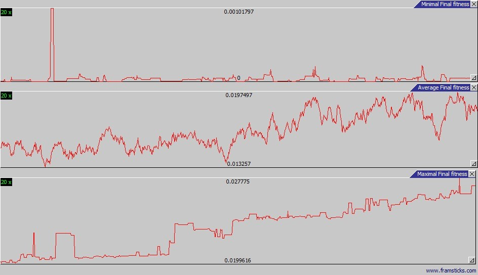
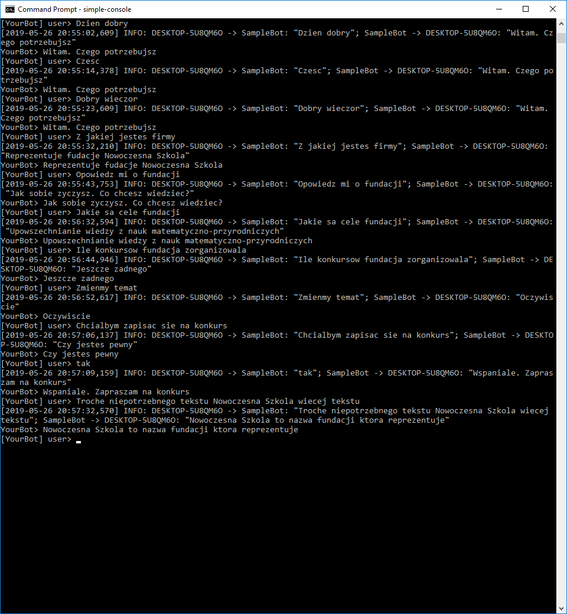
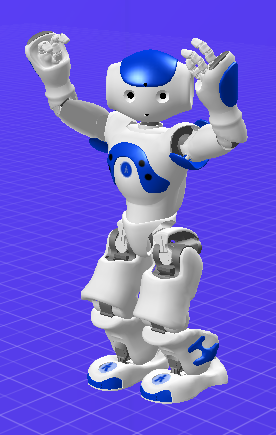
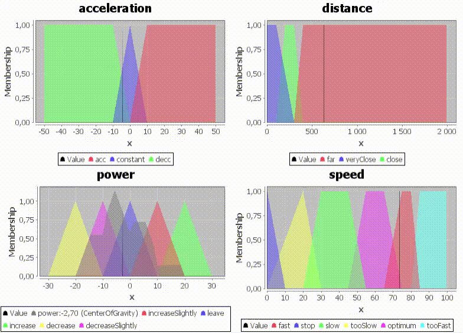

# metody-sztucznej-inteligencji

- [x] [Laboratorium 1 - Framsticks](lab1-framsticks)

  

- [x] [Laboratorium 2 - boty internetowe](lab2-boty)

  

- [x] [Laboratorium 3 - robot Nao](lab3-nao)

  

- [x] [Laboratorium 4 - zbory rozmyte](lab4-zbiory-rozmyte)

  

- [ ] [Laboratorium 5 - sieci neuronowe](lab5-sieci-neuronowe)

- [x] [Laboratorium 6 - automatyczne planowanie](lab6-automatyczne-planowanie)

  
