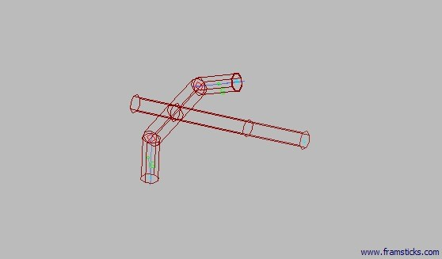
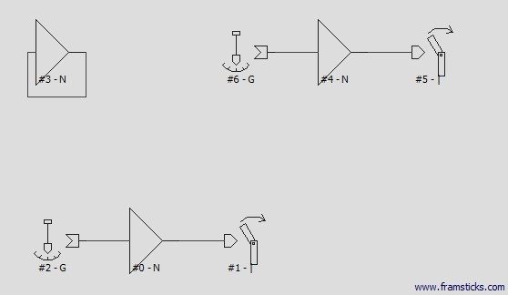
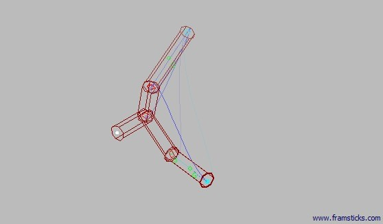
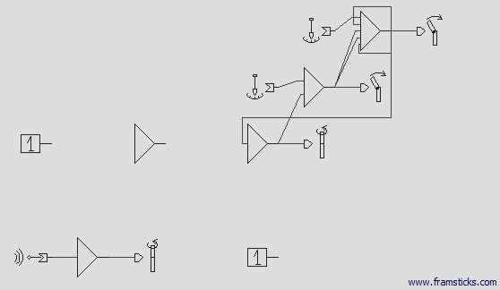

## Framsticks

### Sprawozdanie
Jako google doc: https://docs.google.com/document/d/1CtmeOFYarUZEqythf7XOglmR2UrqVrNwxxS-bqAtzuc/edit?usp=sharing  
Jako plik pdf: [Paweł_Maczuga.pdf](Paweł_Maczuga.pdf)

## Ewolucja organizmu

Ewolucja organizmu nakierowana była na szybkość poruszania się.

### Początkowy organizm

Najszybszy organizm jaki udało mi się stworzyć. Osiąga prędkość ok. 0.0035 jednostek

Genotyp

### Ostatni organizm

Organizm po procesie ewolucji. Prędkość poruszania przestała wzrastać.

Genotyp

### Wykres

Jeden z wykresów pokazujących zmiany prędkości poruszania się w czasie podczas procesu ewolucji

### Konspekt
1. Platforma [Framsticks](http://www.framsticks.com/).
2. Filmy pokazujące przykładowe wyniki eksperymentów: http://www.framsticks.com/a/al_ewol.html
3. Symulator [Framsticks](http://www.framsticks.com/files/apps/Framsticks.zip).
4. Proszę zapoznać się z opisem zadania i zrealizować go posługując się [tutorialem].(http://www.framsticks.com/common/tutorial/index_pl.html)
