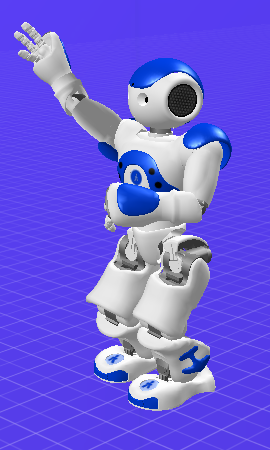

# Robot Nao

Sprawodzdanie: [Paweł_Maczuga.pdf](Paweł_Maczuga.pdf)

Celem zadania było zaprogramowania robota Nao do wykonywania prostych czynności w programie Choreographic.

Program składa się z trzech animacji działających jednocześnie - osobna dla nóg, głowy i ramion:

- Robot idzie w losowym kierunku

- Kręci głową w prawo i lewo

- Wykonuje pięć razy losowy ruch rękami

Program kończy się po wykonaniu ruchów rękami

Przykładowe screeny ze środowiska:

