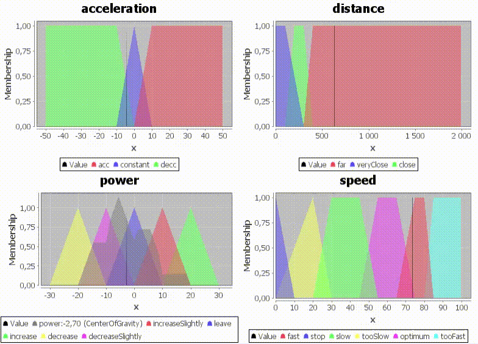

# Zbory rozmyte
## Temat

Stworzenie dowolnego sterownika wykorzystującego zbiory rozmyte. Użyta biblioteka: _jFuzzyLogic_ dla Javy.

Działanie:

Dostosowywanie prędkości samochodu do pojazdu jadącego z przodu, jednocześnie starając się utrzymać prędkość optymalną (w przypadku pojazdu z przodu jadącego z dużą prędkością nie będziemy go gonić).

## Najważniejsze pliki

Plik fcl: 
`car_control.fcl`  
Program do rysowania wykresów:
`CarControlCharts.java`  
Program do dynamicznego pokazywania zmian na wykresach:
`CarControlApp.java`  

## Uruchomienie

Rysowanie wykresów na podstawie parametrów:
```
java CarControlCharts <plik fcl> <speed> <acceleration> <distance>
```

Dynamiczne pokazywania zmian na wykresach:
```
java CarControlApp <plik fcl>
```

## Opis

Po uruchomieniu pliku `CarControlApp.java` możemy obserwować zmiany:
 - **prędkości**
 - **przyspieszenia**
 - **odległości** od pojazdu przed nami
 - zmiany **mocy** silnika - zmienna wyjściowa

Od zmiennej wyjściowej - **mocy**, zależy przyspieszenie samochodu.

Zaraz po rozpoczęciu symulacji nasz samochód stoi (`speed = 0.0`, `acceleration = 0.0`) i znajduje się w pewnej odległości od pojazdu z przodu. Następnie próbuje rozwinąć optymalną prędkość (+/- 60 jednostek). Gdy jest blisko drugiego pojazdu - zwalnia. 

## Wykres

Zaczynając w odległości 600 jednostek od samochodu z przodu poruszającego się z prędkością 40 jednostek pojazd zachowuje się w następujący sposób:

