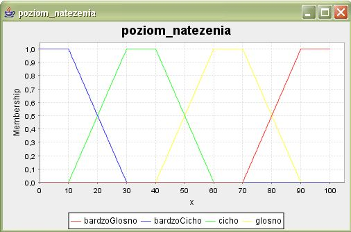
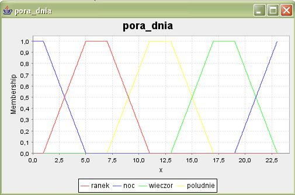
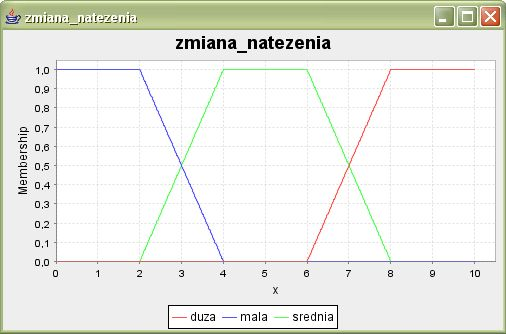
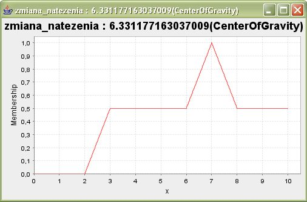

# Tworzenie sterowników rozmytych 
## przy użyciu jFuzzyLogic

Autor ćwiczenia: Adam Łuszpaj  
Poprawki: Bartłomiej Śnieżyński

## SPIS TREŚCI

1. Cel ćwiczenia
2. Wymagania wstępne
3. FCL (Fuzzy Control Language)
4. FCL. Konstrukcja sterownika rozmytego
5. Uruchomienie programu. Wizualizacja
6. Dodatkowe zadania
7. Bibliografia

## CEL ĆWICZENIA

Celem ćwiczenia jest prezentacja możliwości wykorzystania koncepcji logiki i zbiorów rozmytych do projektowania kontrolerów rozmytych przy użyciu języka FCL (Fuzzy Control Language).

## WYMAGANIA WSTĘPNE

W trakcie przeprowadzania ćwiczenia wykorzystane zostaną:
- **Java 1.5+**, do pobrania z http://java.sun.com
- **jFuzzyLogic**, pakiet Java implementujący podejście rozmyte, należy pobrać wersję [1.2.1](resources/jFuzzyLogic_1_2_1.jar) (najnowsza wersja jest do pobrania z http://sourceforge.net/projects/jfuzzylogic/)
- Zakłada się podstawową wiedzę z zakresu podejścia rozmytego i konstrukcji języka FCL, wprowadzenie do języka dostępne jest na http://www.fuzzytech.com/binaries/ieccd1.pdf

W pobranym pliku jar znajdują się również:
- **ANTLR Parser Generator**, zbiór narzędzi do konstruowania parserów, kompilatorów, translatorów, do pobrania z http://www.antlr.org/
- **JFreeChart**, narzędzie do generowania wykresów, do pobrania z http://www.jfree.org/jfreechart
Biblioteki potrzebne jFuzzyLogic znajdują się w jego własnym pakiecie. Aby je wydobyć należy zmienić jego rozszerzenie z jar na zip i wypakować je z katalogu lib. Tworząc projekt w Eclipse można dodać tylko jFuzzyLogic.jar (przycisk Add External Jar w zakładce Libraries). 

## FCL (FUZZY CONTROL LANGUAGE)

Fuzzy Control Language jest rozwijany jako standard **International Electrotechnical Commission**. Na rynku dostępnych jest kilka darmowych bibliotek zgodnych z tym standardem. W tym ćwiczeniu wykorzystana zostanie biblioteka języka Java, jFuzzyLogic.

Do poprawnego działania wymaga ona dwóch dodatkowych komponentów: _JFreeChart_ (generowanie wykresów) oraz _ANTLR Parser Generator_ (obsługa języka FCL). Są one zawarte w pobranym pliku jFuzzyLogic.jar. Ścieżkę do biblioteki należy dodać do zmiennej CLASSPATH. W systemie Windows można to wykonać poleceniem (podając rzeczywistą lokalizację plików):

```
set CLASSPATH = %CLASSPATH%;c:\jFuzzyLogic_1_1_0.jar
```

Oczywiście, tworząc projekt w środowisku typu Eclipse wystarczy dodać bibliotekę jFuzzyLogic do ścieżki projektu (Add External Jar).

Kod funkcji FCL (_fuzzy_volume.fcl_) będziemy edytować korzystając z dowolnego edytora, natomiast do uruchomienia sterownika rozmytego i wizualizacji wyników użyjemy powyższych bibliotek. W tym celu skorzystamy z prostego programu w języku Java, bazującego na nich, który wczyta utworzony sterownik FCL, wykona go dla przykładowych wartości wejściowych i zobrazuje wyniki. Kod programu znajduje się w poniższej ramce (lub na pastebin)

### FuzzyExample.java
```
import net.sourceforge.jFuzzyLogic.FIS;
import net.sourceforge.jFuzzyLogic.rule.FuzzyRuleSet;

public class FuzzyExample {

    public static void main(String[] args) throws Exception {
        try {
            String fileName = args[0];
            int poziomNatezenia = Integer.parseInt(args[1]);
            int poraDnia = Integer.parseInt(args[2]);
            FIS fis = FIS.load(fileName,false);

            //wyswietl wykresy funkcji fuzyfikacji i defuzyfikacji
            FuzzyRuleSet fuzzyRuleSet = fis.getFuzzyRuleSet();
            fuzzyRuleSet.chart();

            //zadaj wartosci wejsciowe
            fuzzyRuleSet.setVariable("poziom_natezenia", poziomNatezenia);
            fuzzyRuleSet.setVariable("pora_dnia", poraDnia);
            //logika sterownika
            fuzzyRuleSet.evaluate();

            //graficzna prezentacja wyjscia
            fuzzyRuleSet.getVariable("zmiana_natezenia").chartDefuzzifier(true);

            //System.out.println(fuzzyRuleSet);

        } catch (ArrayIndexOutOfBoundsException ex) {
            System.out.println("Niepoprawna liczba parametrow. Przyklad: java FuzzyExample string<plik_fcl> int<poziom natezenia> int<pora dnia>");
        } catch (NumberFormatException ex) {
            System.out.println("Niepoprawny parametr. Przyklad: java FuzzyExample string<plik_fcl> int<poziom natezenia> int<pora dnia>");
        } catch (Exception ex) {
            System.out.println(ex.toString());
        }
    }
}
```

Wyjaśnienie konstrukcji zawartych w powyższym kodzie znajduje się na http://jfuzzylogic.sourceforge.net/html/java.html

Dokumentacja (javadoc) biblioteki jFuzzyLogic dostępna jest tutaj: http://jfuzzylogic.sourceforge.net/html/index.html

Dokumentacja biblioteki ANTLR dostępna jest tutaj: http://www.antlr.org/doc/index.html

Dokumentacja biblioteki JFreeChart znajduje się na: http://www.object-refinery.com/jfreechart/guide.html

Oficjalnym dokumentem specyfikującym język FCL jest dokument IEC: http://www.fuzzytech.com/binaries/ieccd1.pdf

## FCL. KONSTRUKCJA STEROWNIKA ROZMYTEGO

Przedstawione zostaną kolejne etapy konstruowania funkcji FCL, która następnie zostanie uruchomiona i zwizualizowana przy pomocy programu FuzzyExample. Ogólny szkielet budowy takiej funkcji przedstawia się następująco:

### Szkielet funkcji implementującej sterownik rozmyty
```
FUNCTION_BLOCK
VAR_INPUT
...
END_VAR
VAR_OUTPUT
...
END_VAR
FUZZIFY
...
END_FUZZIFY
DEFUZZIFY
...
END_DEFUZZIFY
RULEBLOCK
...
END_RULEBLOCK
END_FUNCTION_BLOCK
```

Poszczególne sekcje zawierają:

- `VAR_INPUT` - deklaracja zmiennych wejściowych
- `VAR_OUTPUT` - deklaracja zmiennych wyjściowych
- `FUZZIFY` - fuzyfikacja (rozmywanie) zmiennych
- `DEFUZZIFY` - defuzyfikacja (wyostrzanie)
- `RULEBLOCK` - definicje reguł rozmytych

Poniżej zaprezentowany zostanie przykład sterownika natężenia dźwięku, w którym przesłankami będą aktualny poziom natężenia oraz pora dnia.

### Deklaracje zmiennych

Wejściem sterownika będą dwie zmienne typu rzeczywistego określające poziom natężenia dźwięku oraz porę dnia wyrażoną przez godzinę:

- `poziom_natezenia` - o zakresie (0,100)
- `pora_dnia` - o zakresie (0,23)

Wyjściem będzie zmienna typu rzeczywistego określająca o ile należy zmodyfikować natężenie dźwięku:

- `zmiana_natezenia` - o zakresie (0,10)

Kodujemy to w następujący sposób w FCL:

```
VAR_INPUT
poziom_natezenia : REAL;
pora_dnia : REAL;
END_VAR
VAR_OUTPUT
zmiana_natezenia : REAL;
END_VAR
```

### Fuzyfikacja zmiennych

Zmienne, które pojawiły się w sekcji `VAR_INPUT` rozmywane są w sekcjach `FUZZIFY`, dla każdej zmiennej pisze się osobną sekcję `FUZZIFY`. Definiowane są w niej `TERMY` , czyli pojęcia rozmyte odpowiadające danej zmiennej. Arbitralnie wybiera się zbiór wartości określający dany termin i każdej z wartości przypisuje się stopień odpowiedniości do określanego terminu.

```
FUZZIFY poziom_natezenia
TERM bardzoCicho := (0, 1) (10, 1) (20, 0.50) (30, 0);
TERM cicho := (10, 0) (20, 0.50) (30, 1) (40, 1) (50, 0.50) (60, 0);
TERM glosno := (40, 0) (50, 0.50) (60, 1) (70, 1) (80, 0.50) (90, 0);
TERM bardzoGlosno := (70, 0) (80, 0.50) (90, 1) (100, 1);
END_FUZZIFY

FUZZIFY pora_dnia
TERM ranek := (1, 0) (3, 0.50) (5, 1) (7, 1) (9, 0.50) (11, 0);
TERM poludnie := (7, 0) (9, 0.50) (11, 1) (13, 1) (15, 0.50) (17, 0);
TERM wieczor := (13, 0) (15, 0.50) (17, 1) (19, 1) (21, 0.50) (23, 0);
TERM noc := (0,1) (1, 1) (3, 0.50) (5, 0) (19, 0) (21, 0.50) (23, 1);
END_FUZZIFY
```

### Defuzyfikacja

W sekcji `DEFUZZIFY` określa się rozmycie/wyostrzenie zmiennej wyjściowej, czyli tej, która pojawiła się w sekcji `VAR_OUTPUT`. Ponadto podawana jest nazwa metody (`METHOD`), która ma być użyta do wyliczenia wartości wyjściowej oraz wartość domyślna (`DEFAULT`) w przypadku, gdyby algorytm nie mógł jej obliczyć.

```
DEFUZZIFY zmiana_natezenia
TERM przycisz := (0, 1) (2, 1) (3, 0.50) (4, 0) (7, 0);
TERM zostaw := (2, 0) (3, 0.50) (4, 1) (6, 1) (7, 0.50) (8, 0);
TERM podglosnij := (3, 0) (6, 0) (7, 0.50) (8, 1) (10, 1);
METHOD : COG;
DEFAULT := 0;
END_DEFUZZIFY
```

Dostępne metody obliczania wartości wyjściowej w FCL:

- _COG (Center of Gravity)_
- _COGS (Center of Gravity for Singletons)_
- _COA (Center of Area)_
- _LM (Left Most Maximum)_
- _RM (Right Most Maximum)_
Szczegółowy ich opis znaleźć można w dokumencie: http://www.fuzzytech.com/binaries/ieccd1.pdf

### Reguły

Ostatnim elementem implementowanego przez nas sterownika są reguły wnioskowania. Umieszcza się je w jednej lub większej ilości sekcji `RULEBLOCK`. First jest nazwą bloku, następnie następują definicje użytych operatorów (_agregacja_). W poniższym kodzie używany jest wyłącznie operator `AND`, który jest zdefiniowany jako minimum operandów (`MIN`). OperatorOR definiuje się zazwyczaj jako maximum (`MAX`). Następnie definiowana jest funkcja aktywacji (`MIN` lub `PROD`), określająca stopień przynależności konkluzji w oparciu o stopień przynależności przesłanki. Kluczowym elementem jest sam zbiór reguł rozmytych wyznaczających logikę sterownika. Każdej regule przyporządkowany jest kolejny numer (`RULE X`).

```
RULEBLOCK first 
AND: MIN;
ACT: MIN;

RULE 0: IF poziom_natezenia IS bardzoCicho AND pora_dnia IS ranek THEN zmiana_natezenia IS podglosnij;
RULE 1: IF poziom_natezenia IS cicho AND pora_dnia IS ranek THEN zmiana_natezenia IS zostaw;
RULE 2: IF poziom_natezenia IS glosno AND pora_dnia IS ranek THEN zmiana_natezenia IS zostaw;
RULE 3: IF poziom_natezenia IS bardzoGlosno AND pora_dnia IS ranek THEN zmiana_natezenia IS przycisz;

RULE 4: IF poziom_natezenia IS bardzoCicho AND pora_dnia IS poludnie THEN zmiana_natezenia IS podglosnij;
RULE 5: IF poziom_natezenia IS cicho AND pora_dnia IS poludnie THEN zmiana_natezenia IS podglosnij;
RULE 6: IF poziom_natezenia IS glosno AND pora_dnia IS poludnie THEN zmiana_natezenia IS zostaw;
RULE 7: IF poziom_natezenia IS bardzoGlosno AND pora_dnia IS poludnie THEN zmiana_natezenia IS przycisz;

RULE 8: IF poziom_natezenia IS bardzoCicho AND pora_dnia IS wieczor THEN zmiana_natezenia IS podglosnij;
RULE 9: IF poziom_natezenia IS cicho AND pora_dnia IS wieczor THEN zmiana_natezenia IS zostaw;
RULE 10: IF poziom_natezenia IS glosno AND pora_dnia IS wieczor THEN zmiana_natezenia IS przycisz;
RULE 11: IF poziom_natezenia IS bardzoGlosno AND pora_dnia IS wieczor THEN zmiana_natezenia IS przycisz;

RULE 12: IF poziom_natezenia IS bardzoCicho AND pora_dnia IS noc THEN zmiana_natezenia IS zostaw;
RULE 13: IF poziom_natezenia IS cicho AND pora_dnia IS noc THEN zmiana_natezenia IS zostaw;
RULE 14: IF poziom_natezenia IS glosno AND pora_dnia IS noc THEN zmiana_natezenia IS przycisz;
RULE 15: IF poziom_natezenia IS bardzoGlosno AND pora_dnia IS noc THEN zmiana_natezenia IS przycisz;

END_RULEBLOCK
```

Szczegółowy opis wszystkich parametrów algorytmu znajduje się w dokumencie: http://www.fuzzytech.com/binaries/ieccd1.pdf

## URUCHOMIENIE PROGRAMU. WIZUALIZACJA

Program FuzzyExample uruchamia się w następujący sposób:

`java FuzzyExample <sciezka_do_pliku_fuzzy_volume.fcl> <natezenie_dzwieku> <godzina>`

Zakres zmiennej wejściowej `natezenie_dzwieku`: (0 .. 100)

Zakres zmiennej wejściowej `godzina`: (0 .. 23)

np. `java FuzzyExample fuzzy_volume.fcl 50 12`

Efektem jego działania jest wartość zmiennej wyjściowej `zmiana_natezenia` w zakresie (0 .. 10) oraz zbiór wykresów:

  
Zbiory rozmyte definiujące zmienną wejściową poziom_natezenia

  
Zbiory rozmyte definiujące zmienną wejściową pora_dnia

  
Zbiory rozmyte definiujące zmienną wyjściową zmiana_natezenia

Na rysunku mala=przycisz, srednia=zostaw, duza=podgłośnij.

  
Wynik działania dla wartości wejściowych:  
`natezenie_dzwieku = 50`  
`pora_dnia = 12`


Pierwsze dwa wykresy przedstawiają definicje zbiorów wejściowych sterownika. Trzeci to zbiory zmiennej wyjściowej. Ostatni wykres przedstawia zagregowany zbiór wyjściowy po odpaleniu reguł 5 i 6. Pora dnia to południe (ze stopniem pewności 1), poziom natężenia to cicho i głośno (ze stopniem pewności 0.5). Dlatego w regułach 5 i 6 wniosek odcinany jest na wysokości 0.5. Tak więc wykres wynikowy ma maksimum w punkcie 7, w którym zielony i czerwony trapez przecinają się na wysokości 0.5.

## DODATKOWE ZADANIA

- obserwacja charakterystyk sterownika dla różnych wartości parametrów wejściowych
- uruchomienie programu FuzzyExample dla różnych metod defuzyfikacji
- uruchomienie programu FuzzyExample dla różnych metod agregacji/aktywacji
- modyfikacja definicji zbiorów rozmytych oraz reguł

# Zadanie
Proszę wybrać dziedzinę i utworzyć dla niej sterownik rozmyty. W systemie powinny być 3-4 zmienne wejściowe, jedna zmienna wyjściowa i 10-15 reguł.

Na ocenę 4.5-5.0 proszę również dorobić symulator - applet/aplikację demonstrującą działanie sterownika (podobny do appletów "dźwig", "odwrócone wahadło"). Symulator powinien być dynamiczny - stan powinien się zmieniać nawet jeśli użytkownik nic nie zmienia.

Wszystkie wartości zmiennych wejściowych powinny być pokryte przez reguły. Nie znaczy to jednak, że w regułach trzeba uwzględnić wszystkie kombinacje zbiorów. Przykładowo, w niektórych regułach może występować jedna zmienna, co pokrywa znaczną część przestrzeni.

Uwaga! Proszę załączyć pliki flc oraz java oraz class - tak by można było łatwo uruchomić system. W przypadku appletu proszę również o stronę html ze wstawionym appletem i kod źródłowy appletu. Nazwa archiwum powinna mieć postać `<nazwisko>-<imie>-<temat>`.

W przypadku projektów na 4.5-5.0 proszę przyjść na zajęcia i zademonstrować działanie sterownika. W pozostałych przypadkach wystarczy wstawić rozwiązanie do moodle, choć oczywiście można przyjść. Jeśli Państwo nie będą demonstrować systemu, proszę wstawić wraz z kodem krótki opis (do 2 stron), który pozwoli mi uruchomić system:

1. Wejścia i wyjścia sterownika (najlepiej wykresy).
2. Idea/objaśnienie reguł (w punktach - co robią poszczególne grupy reguł lub reguły)
3. Przykłady użycia (wartości wejść i wyjść).