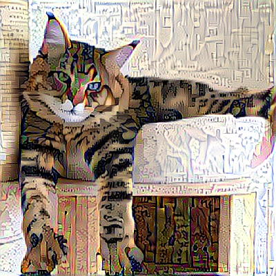
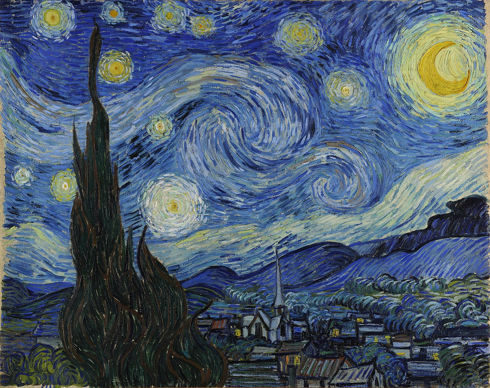

# Konwolucyjne sieci neuronowe

## Opis laboratorium

[neurolab.pdf](neurolab.pdf)

## Wizualizacja wielu warstw

Funkcja `visualise_process(model, x, layers_range)` wizualizuje warstwy z `layers_range` dla modelu `model` i obrazu `x`. Limit warstw = 9. Limit kałów = 32. Pobrana sieć ma 156 warstw. Pokazanie wszystkich razem ze wszystkimi kanałami (1280 dla warstwy 154) byłoby trudne.

Pięć pierwszych warstw:


## Zakrywanie części obrazu

Przykładowe heatmapy dla kilku obrazów z przesuwającym się zakrywającym je szarym kwadratem:


## Art style transfer

### Warstwy sieci wykorzystane w funkcji straty

#### Warstwy VGG19:

```Layer 0 : ('input_1', <tf.Tensor 'concat:0' shape=(3, 400, 400, 3) dtype=float32>)
Layer 1 : ('block1_conv1', <tf.Tensor 'block1_conv1/Relu:0' shape=(3, 400, 400, 64) dtype=float32>)
Layer 2 : ('block1_conv2', <tf.Tensor 'block1_conv2/Relu:0' shape=(3, 400, 400, 64) dtype=float32>)
Layer 3 : ('block1_pool', <tf.Tensor 'block1_pool/MaxPool:0' shape=(3, 200, 200, 64) dtype=float32>)
Layer 4 : ('block2_conv1', <tf.Tensor 'block2_conv1/Relu:0' shape=(3, 200, 200, 128) dtype=float32>)
Layer 5 : ('block2_conv2', <tf.Tensor 'block2_conv2/Relu:0' shape=(3, 200, 200, 128) dtype=float32>)
Layer 6 : ('block2_pool', <tf.Tensor 'block2_pool/MaxPool:0' shape=(3, 100, 100, 128) dtype=float32>)
Layer 7 : ('block3_conv1', <tf.Tensor 'block3_conv1/Relu:0' shape=(3, 100, 100, 256) dtype=float32>)
Layer 8 : ('block3_conv2', <tf.Tensor 'block3_conv2/Relu:0' shape=(3, 100, 100, 256) dtype=float32>)
Layer 9 : ('block3_conv3', <tf.Tensor 'block3_conv3/Relu:0' shape=(3, 100, 100, 256) dtype=float32>)
Layer 10 : ('block3_conv4', <tf.Tensor 'block3_conv4/Relu:0' shape=(3, 100, 100, 256) dtype=float32>)
Layer 11 : ('block3_pool', <tf.Tensor 'block3_pool/MaxPool:0' shape=(3, 50, 50, 256) dtype=float32>)
Layer 12 : ('block4_conv1', <tf.Tensor 'block4_conv1/Relu:0' shape=(3, 50, 50, 512) dtype=float32>)
Layer 13 : ('block4_conv2', <tf.Tensor 'block4_conv2/Relu:0' shape=(3, 50, 50, 512) dtype=float32>)
Layer 14 : ('block4_conv3', <tf.Tensor 'block4_conv3/Relu:0' shape=(3, 50, 50, 512) dtype=float32>)
Layer 15 : ('block4_conv4', <tf.Tensor 'block4_conv4/Relu:0' shape=(3, 50, 50, 512) dtype=float32>)
Layer 16 : ('block4_pool', <tf.Tensor 'block4_pool/MaxPool:0' shape=(3, 25, 25, 512) dtype=float32>)
Layer 17 : ('block5_conv1', <tf.Tensor 'block5_conv1/Relu:0' shape=(3, 25, 25, 512) dtype=float32>)
Layer 18 : ('block5_conv2', <tf.Tensor 'block5_conv2/Relu:0' shape=(3, 25, 25, 512) dtype=float32>)
Layer 19 : ('block5_conv3', <tf.Tensor 'block5_conv3/Relu:0' shape=(3, 25, 25, 512) dtype=float32>)
Layer 20 : ('block5_conv4', <tf.Tensor 'block5_conv4/Relu:0' shape=(3, 25, 25, 512) dtype=float32>)
Layer 21 : ('block5_pool', <tf.Tensor 'block5_pool/MaxPool:0' shape=(3, 12, 12, 512) dtype=float32>)
```

#### Wykorzystane

Wykorzystane w funkcji `content_loss`:

- `Layer 18: 'block5_conv2'`

Wykorzystywane w funkcji `style_loss`:

- `Layer 1: 'block1_conv1'`
- `Layer 4: 'block2_conv1'`
- `Layer 7: 'block3_conv1'`
- `Layer 12: 'block4_conv1'`
- `Layer 17: 'block5_conv1'`

Wykorzystane w funkcji `contnent_loss`:

- wyjściowy obraz - zmienna `combination_image`

#### Wizualizacja

Dla zdjęcia:


I wzorca:


- `content_loss`: warstwa 18


- `style_loss`: warstwy 1, 4, 7, 12, 17


- zdjęcie po pierwszej iteracji:

  

### Własna para zdjęcie + wzorzec

Zdjęcie:


Wzorzec: 



Wynik (po 10 iteracjach):


### Wartość funkcji straty

Dla powyższego przykładu wartość dla kolejnych iteracji wynosi:

-  5775656000.0
- 3987009500.0
-  3398018600.0
- 3151171300.0
- 2998827800.0
- 2907992300.0
- 2836749600.0
-  2787410200.0
-  2747376000.0
-  2717831000.0

Nie udało mi się dostać do części składowych

### Zmiana wag składowych

`total_variation_weight = 1`  - domyślne 
`style_weight= 10`   
`content_weight = 0.025` - domyślne


`total_variation_weight = 1` - domyślne   
`style_weight= 1`  - domyślne   
`content_weight = 10`


