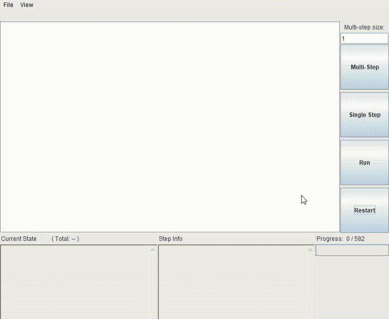

# Automatyczne planowanie przy pomocy planera HTN SHOP2

## Uruchomienie zadania

- Folder `JSHOP2GUI_1.0.1/examples/logistics`
- kompilacja `compile.bat`
- uruchomienie `run.bat`
- Pod Windows. Linux polecenia z .bat (';' -> ':')

## Ważne pliki
- folder `images`
- `logistics` - logika rozwiązania
- `problem`
- `antlr.jar`, `JSHOP2.jar`
- `compile.bat`, `run.bat`
- `gui.java`

## Działanie



# Opis ćwieczenia

Adres internetowy oprogramowania: http://www.cs.umd.edu/projects/shop/   
Pliki do pobrania: http://sourceforge.net/projects/shop/files/

## Wymagania:

- Java SDK, skonfigurowana na systemie operacyjnym,
- JSHOP2GUI_1.0.1.zip _ aplikacja planera,
- edytor tekstowy _ najlepiej z podświetlaniem nawiasów otwierających/zamykających i ew. wyświetlający białe znaki, np. SciTE.

## Plan ćwiczenia:

- Uruchomienie i analiza przykładowego problemu planistycznego.
  1. Zapoznanie się ze sposobem definiowania domeny i problemu planistycznego na przykładzie załączonego w aplikacji przykładu examples\logistics ,
  2. Uruchomienie przykładu - obsługa gui, analiza wyników.
- Modyfikacja przykładu.

## SHOP - Simple Hierarchical Ordered Planner

SHOP (napisany w Lispie, czy JSHOP, jego Javowa odmiana) jest dziedzinowo niezależnym, automatycznym systemem planowania, bazującym na uporządkowanej dekompozycji zadań (ordered task decomposition), będącym rodzajem planowania typu HTN (Hierarchical Task Network; hierarchiczna sieć zadań).

W planowaniu HTN, cały proces zaczyna się od pewnego stanu początkowego. Jego zadaniem jest utworzenie planu wykonania zbioru zadań (tasks; abstrakcyjna reprezentacja rzeczy, które muszą być wykonane). Planowanie HTN opiera się na redukcji problemu - planner rekursywnie dekomponuje zadania na podzadania, zatrzymując się przy napotkaniu zadań podstawowych (primitive), które mogą być bezpośrednio wykonane przez operatory planowania (planning operators). Definiuje się zestawy metod (methods), których zadaniem jest pokazanie plannerowi sposobu dekompozycji zadań złożonych na prostsze (pod warunkiem spełnienia pewnych założeń początkowych). Dla każdego zadania może istnieć więcej niż jeden sposób dekompozycji na podzadania. Planner może próbować kilku takich sposobów, aż znajdzie same rozwiązywalne problemy niższego poziomu.

Planer uporządkowanej dekompozycji zadań jest planerem HTN, którego planowanie jest zgodne z porządkiem wykonywanych później zadań. Zmniejsza to złożoność wnioskowania i eksponuje ekspresywność algorytmu. W dodatku do zwykłych metod i operatorów HTN, stosowane są też aksjomaty, symboliczne/numeryczne warunki oraz wywołania funkcji zewnętrznych.

Poniżej przedstawiono główne elementy problemu planistycznego, wyrażone w języku planera SHOP (JSHOP2) (dokładniej w dokumentacji aplikacji):

### Domena planowania:

```
(defdomain domain-name (d1 d2 . . . dn))
```

gdzie

`dj` jest definicją operatora, metody lub aksjomatu.

### Operator:

```
(:operator h P D A [c])
```

- `h` - sygnatura_ operatora: nazwa i parametry (nazwy poprzedzone przez `?`, np. `?x` oznaczają zmienne), np. `(!drive-to ?truck ?old-location ?location)`,
- `P` - warunek wstępny zastosowania operatora, np. `((predicateA ?y ?z))`
- `D` - lista usuwająca operatora `((a...) (b...) ... (s...))`; fakty usuwane z bazy wiedzy przy zastosowaniu operatora. Jeśli odzwierciedlalibyśmy fakt przekazania przez jedną osobę przedmiotu drugiej osobie, w sekcji usuwanej musielibyśmy odzwierciedlić, że przedmiot już nie jest w posiadaniu pierwszej osoby: `((has-object ?object ?person-from))` ... lista jednoelementowa
- `A` - lista dodająca operatora `((a...) (b...) ... (s...))`; fakty dodawane/wykonywane na bazie wiedzy przy zastosowaniu operatora. W opisanej powyższej sytuacji, w liście dodającej byłby fakt posiadania obiektu przez druga osobę: `((has-object ?object ?person-to))`
- `c` - koszt operatora (opcjonalnie) Czyli np. cała definicja operatora przekazania obiektu od osoby jednej do drugiej byłaby następująca:

```
(:operator (!pass-object ?object ?person-from ?person-to)
	((has-object ?object ?person-from))
	((has-object ?object ?person-from))
	((has-object ?object ?person-to))
)
```

- `h` = `(!pass-object ?object ?person-from ?person-to)` - operator pass-object ma 3 parametry: przekazywany obiekt oraz osoba przekazująca i przyjmująca obiekt
- `P` = `((has-object ?object ?person-from))` - warunkiem przekazania obiektu jest posiadanie go przez osobę przekazującą
- `D` = `((has-object ?object ?person-from))` - po zastosowaniu operatora (przekazaniu obiektu) z domeny należy usunąć fakt posiadania go przez osobę przekazującą
- `A` = `((has-object ?object ?person-to))` - po przekazaniu obiektu (wykonaniu operatora), dodajemy do dziedziny fakt posiadania obiektu przez biorcę obiektu
- `c` = nie ma, czyli domyślnie 1, ale ta informacja nie jest wykorzystywana w przykładzie

### Metoda:


```
(:method h [name1] L1 T1 [name2] L2 T2 . . . [namen] Ln Tn)
```

- `h` - sygnatura metody,
- `[name1]` - opcjonalne nazwy dla par (Li, Ti),
- `Li` - warunek wstępny dla Ti (lista)
- `Ti` - lista zadań do wykonania przy spełnionym warunku Li
- Metoda oznacza, że zadanie z sygnatury metody może być wykonane poprzez wykonanie wszystkich zadań z jednego z `Ti` (pierwszego `Ti`, dla którego warunek wstępny `Li` jest spełniony, pozostałe `Tj` są pomijane).

Przykład - jedzenie pożywienia `{h = (eat ?food)}` za pomocą widelca `{T1 = ((!eat-with-fork ?food ?fork))}`, jeśli go mamy `{L1 = ((have-fork ?fork))}`, lub za pomocą łyżki `{T2 = ((!eat-with-spoon ?food ?spoon))}`, jeśli ją mamy `{L2 = ((have-spoon ?spoon))}`: `(:method (eat ?food) eat-with-fork-if-have-fork ((have-fork ?fork)) ((!eat-with-fork ?food ?fork)) eat-with-spoon-if-have-spoon ((have-spoon ?spoon)) ((!eat-with-spoon ?food ?spoon)) )`

### Aksjomat:

```(:- a [name1] L1 [name2] L2 . . . [namen] Ln)```

- `a` - logiczny atom
- `Li` - warunek logiczny
- `[namei]` - opcjonalna nazwa dla warunku logicznego Li
- Semantyka jest następująca: `a` jest prawdziwe jeśli `L1` jest prawdziwe, lub gdy `L1` jest fałszywe, lecz `L2` jest prawdziwe, lub.... lub gdy `L1`...`Ln-1` są fałszywe, lecz `Ln` jest prawdziwe.

### Term `call`:


```
(call f t1 t2 _ tn)
```

- `f` - symbol procedury lub specjalny symbol wbudowany w JSHOP2, np. _+_ - dodawanie.
- `ti` - termy (zmienne bądź stałe), będące argumentami procedury

Przykład:
```
(call + 10 4) przyjmie wartość 14
(call + (call + 3 4) 5) przyjmie wartość 12
```

### Problem planistyczny:

```
(defproblem problem-name domain-name (a[1,1] a[1,2] ... a[1,n]) T1 . . . (a[m,1] a[m,2] ... a[m,n]) Tm)
```


## Przebieg ćwiczenia:

### Przykład logistics.

Opis domeny: Mamy różne miasta, a w nich wybrane lokacje, w których mogą się znajdować obiekty naszego zainteresowania - paczki, które mamy przewieźć z jednej lokacji na inną (w tym samym, bądź innym mieście), zgodnie z definicją problemu logistycznego. Po wybranym mieście paczki przewożą ciężarówki, ale tylko te ciężarówki, które są przypisane do konkretnego miasta - każda przewozi na raz jedną paczkę. Na początku transportu ciężarówką, paczkę się do niej pakuje, na końcu przewozu _ rozpakowuje. Wybrana lokacja w mieście zawiera lotnisko. Między miastami kursują samoloty i to one tylko mogą przewieźć paczkę między różnymi miastami (a dokładniej od lotniska miasta 1 do lotniska miasta 2). Przed rozpoczęciem lotu następuje załadowanie na pokład paczki, po zakończeniu lotu _ rozładunek paczki. Przykładowe, najbardziej skomplikowane rozwiązanie opisanego problemu planistycznego jest następujące (przewiezienie paczki z miasta 1, lokacji 1, do miasta 2, lokacji 2):

- Podjedź ciężarówką, jeżdżącą po mieście 1 z jej obecnej lokacji do lokacji 1, gdzie jest paczka.
- Załaduj paczkę i pojedź tą ciężarówką do lokacji miasta 1, będącej jego lotniskiem.
- Rozładuj paczkę.
- Podleć samolotem na lotnisko miasta 1, załaduj na pokład paczkę i poleć na lotnisko miasta 2 i rozładuj z pokładu paczkę.
- Podjedź ciężarówką, jeżdżącą po mieście 2 do lotniska miasta 2 po paczkę.
- Załaduj ją i pojedź do jej miejsca przeznaczenia, lokacji 2 miasta 2.
- Rozładuj paczkę. Paczka została dowieziona.

### Uruchomienie przykładu:

Przykład planera przewozu paczek jest w aplikacji JSHOP2GUI, w katalogu examples\logistics. Katalog ten zawiera pliki: gui.java _ klasę główną planera przewozu paczek, logistics - definicja domeny przewozów, z definicjami operatorów, metod i aksjomatów; problem - zadanie planistyczne, w skład którego wchodzi część inicjalizacyjna (predykaty, stany początkowe, np. początkowe lokalizacje paczek, ciężarówek, samolotów, czy definicje lokacji itp.) oraz pożądany stan końcowy (docelowe lokalizacje dla paczek). Aby uruchomić przykład należy (zakładamy, że potrzebne biblioteki JSHOP2.jar, antl.jar, które są w archiwum aplikacji, zostały skopiowane do katalogu przykładu i jest on naszym katalogiem bieżącym):

- a) wygenerować klasy definicji domeny (polecenie `java -cp .;JSHOP2.jar;antlr.jar JSHOP2.InternalDomain logistics`),
- b) wygenerować klasy problemu (polecenie `java -cp .;JSHOP2.jar;antlr.jar JSHOP2.InternalDomain -r problem`),
- c) skompilować wszystkie klasy w katalogu (`javac -cp .;JSHOP2.jar;antlr.jar *.java`),
- d) uruchomić gui planera (`java -cp .;JSHOP2.jar gui`). W otwartym oknie kliknąć `Run` - zostanie wyliczony plan i końcowy stan


Prześledzenie wybranych wyników, próba małych modyfikacji stanu początkowego lub docelowego i zaobserwowanie wpływu zmiany na wynikowy plan.

### Modyfikacja przykładu:

Należy obliczyć sumaryczny koszt przewozu każdej paczki, zakładając następujące koszty składowe:

- załadowanie/rozładowanie ciężarówki - 1,
- załadowanie/rozładowanie samolotu - 3,
- pojedynczy przejazd ciężarówki (z lub bez ładunku) - 10,
- pojedynczy przelot samolotem (z lub bez ładunku) -100.

### Przydatne informacje:

1. dokumentacja JSHOP2 (pdf) w aplikacji i opis struktury elementów planistycznych w opisie ćwiczenia.
2. użyć nowego atomu/predykatu `(cost ?obj ?value)`, przypisującego koszt ?value do obiektu `?obj`.
3. zapoznać się ze strukturą operatorów (będą modyfikowane), z wyróżnieniem fragmentów P, D, A.
4. zapoznać się z termem call.
5. pamiętać o sekcji inicjalizacji problemu.
6. koszty przewozu każdej paczki mają być widoczne w gui w oknie stanu końcowego (np. `(cost package1 222)`).

## Bibliografia

1. http://www.cs.umd.edu/projects/shop/description.html i wylistowane na niej publikacje
2. Okhtay Ilghami, Documentation for JSHOP2
3. **Realizacja planera w języku Python: https://bitbucket.org/dananau/pyhop**